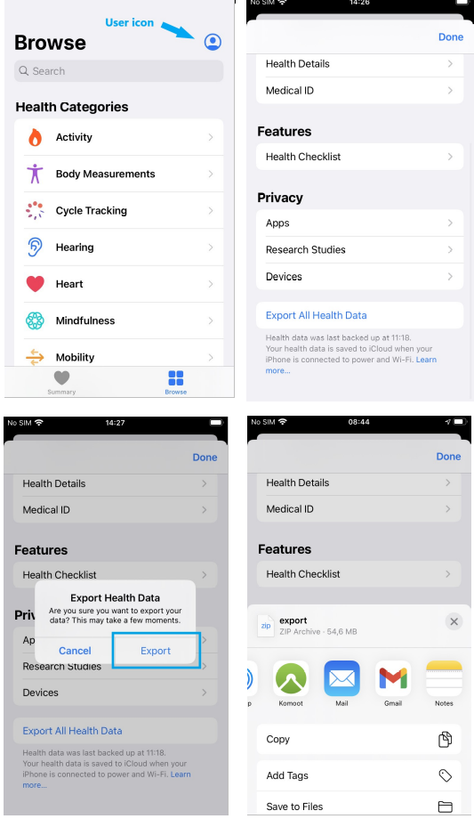

# AppleDashboard
This project provides a dashboard for visualization health and workout data from Apple Watch. The tool allow to load and analyze data from 
multiple users at the same time.
It was created to enable faster analysis of longitudinal data from Apple Watch without the need for programming skills.

## Download data from Apple Watch ##
Export "Health data" from Apple watch:
1. Go to Heath app
2. Press user icon 
3. Scroll down to the bottom of Health profile and press on "Export All Health data"  
4. Press on "Export" to confirm that you want export data  
5. Choose the method how you want save or share data  

## Setup production ###

#### Requirements ####
* [Docker-CE](https://docs.docker.com/install/) >= 20.10.2
* [docker-compose](https://docs.docker.com/compose/overview/) >= 1.27.0

#### Usage ####
1.Open Terminal (in Windows: Command window(cmd))

2.Go to AppleDashboard directory

3.Build the images and run the containers:
* `$ docker-compose up -d`

Test it out at http://localhost:600. No mounted folders. To apply changes, the image must be re-built.  
[Data import information](#data-import)

## Setup Development ## [detailed documentation](https://github.com/dieterich-lab/AppleDashboard/tree/master/Documentation)
Not recommended for pure deployment.

#### Requirements ####
* [Python](https://www.python.org/) >= 3.7
* [pipenv](https://docs.pipenv.org/en/latest/) >= 19.2.3
* [Docker-CE](https://docs.docker.com/install/) >= 20.10.2
* [docker-compose](https://docs.docker.com/compose/overview/) >= 1.27.0
* Linux/MacOS

#### Usage ####
1.Open Terminal 

2.Go to AppleDashboard directory

3.Run commands:
* `pipenv install` installs the latest dependencies
* `pipenv shell` enters the virtual environment
* `docker-compose up` necessary for creating container for PostgreSQL database
* `./scripts/start.sh`

Test it out at http://localhost:8050. The "web" folder is mounted into the container and your code changes apply automatically.

## Data Import ##

### Importing new data ###
* To add new data, add the `export.xml` files and `electrocardiogram` directories downloaded from iPhone to the `.import` folder.

In case of load data from more than one device, each `export.xml` file and `electrocardiogram` directory should be 
numbered at the end, example:
* `export1.xml`,`export2.xml`,`export3.xml` etc.
* `eclectrocardiogram1`,`electrocardiogram2`,`electrocardiogram3` etc.

To work the files should have the same format as the current example files that are already in the `dataset_examples` directory.
The examples files look like the files downloaded from Apple Watch without any modifications.

